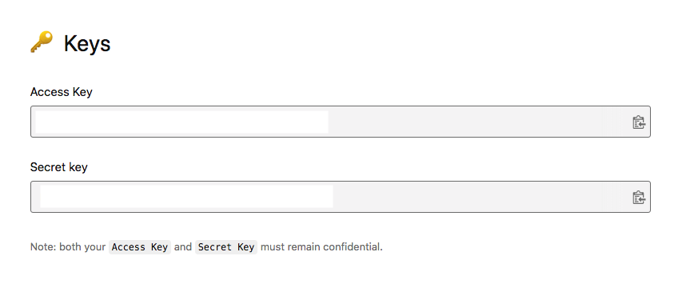

# Infinite Scroll Photo Viewer - Unsplash

Creation of infinity scroll. It continuously loads new images into view when scrolling.

### Motivation for this project

The idea for this project from [JavaScript Web Projects: 20 Projects to Build Your Portfolio](https://academy.zerotomastery.io/p/javascript-projects). I encourage you to check it out.

### Getting Started

- You need to have basic understanding of HTML, CSS(Grid), and Javascript.

### Connecting to Unsplash Dashboard
- Create an account on [Unsplash](https://unsplash.com/developers). Then Log in

- Create an app from the dashboard, click on **Your apps** to create one.

- To get your API_KEY, click the **New Application** button

- Give your application a name and description. When you're done, click on **Create application**

- Access you key. To be used in calling your endpoint

### Online Tools

Favicon generator [realfavicongenerator](https://realfavicongenerator.net/)

### Deployment

Netlify

Project [view](https://terieyenike.github.io/infinity)

+ Clone the repo and contribute if you find this useful and definitely give it a star.
